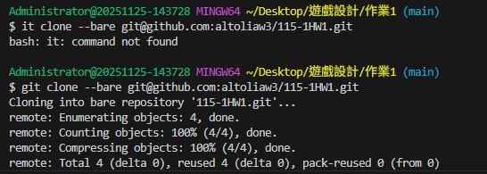
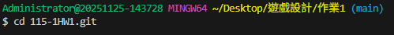
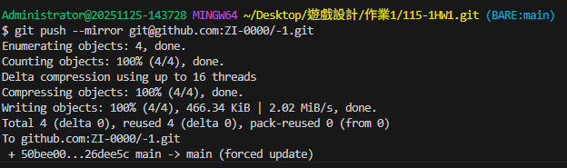
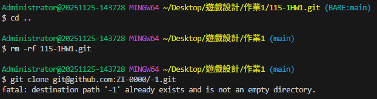
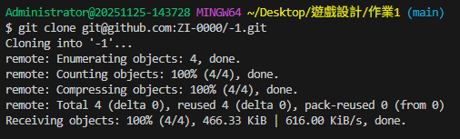
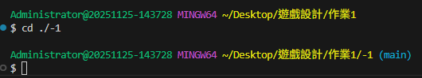
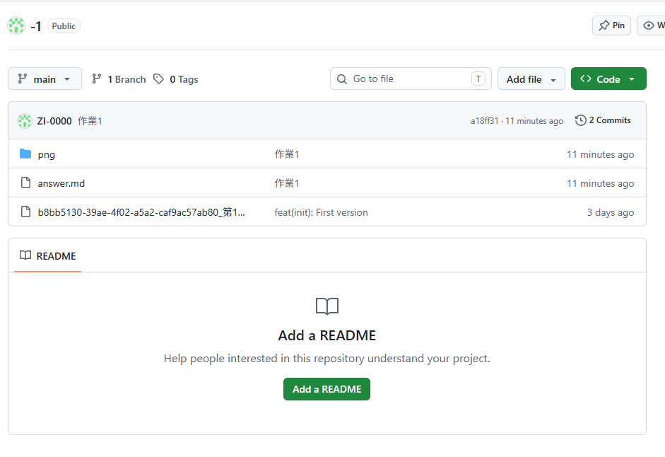
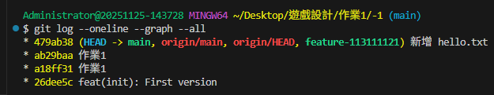
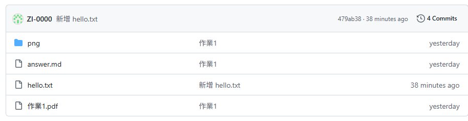
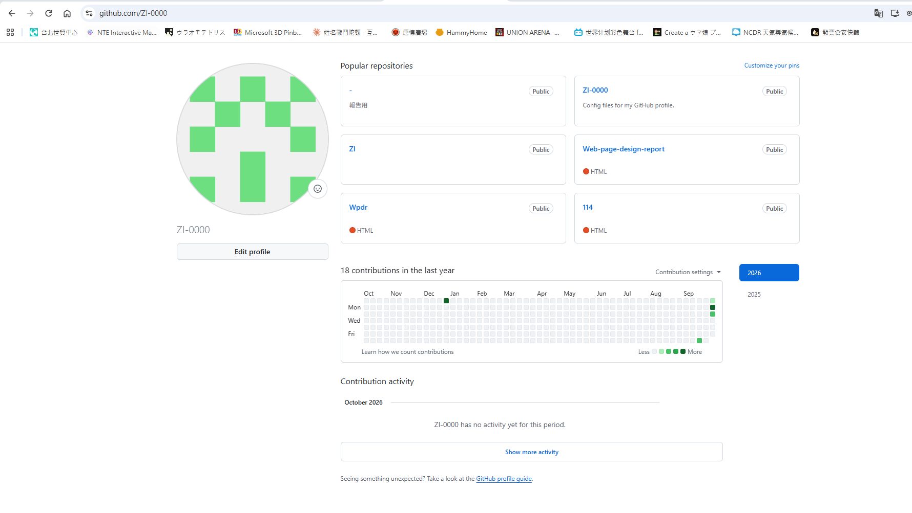

# 第1次作業題目-隨堂-HW1
>
>學號：113111121
><br />
>姓名：邱怡瑄
><br />
>作業撰寫時間：超過 180 mins
><br />
>最後撰寫文件日期：2023/10/02
>

作答區:
1. 

Ans:
圖1:
一開始因為少打了g，導致無法執行git clone，導致我無法進行下載。後來修正過後就可以從115-1HW1倉庫中複製一份到我的倉庫資料夾內，即可執行下一個步驟。

 

圖2:
因為成功複製專案，所以執行cd指令進入到複製過來的位置。此時(main)變成了(BARE:main)，所以可以確認我已經成功進入該專案的位置。


圖3:
為了將這份專案從115-1HW1中轉移到作業1/-1的資料夾中，我執行了 --mirror 指令將115-1HW1專案上傳至-1資料夾裡面，最後顯示為main -> main (forced update)，所以成功轉移至-1資料夾裡面。


圖4:
成功轉移後，我就去把複製的那一份暫存檔刪掉。然後重新下載一份屬於自己的專案，結果因為原先就有-1這個資料夾了，所以我無法再重複取一樣的資料夾名字。


圖5:
後來手動在外部直接刪除-1資料夾後，再重新下載在-1資料夾之後，顯示Cloning into '-1'... 並且 Receiving objects: 100%，就成功下載一份全新的專案至我的電腦上。


圖6:
因為我的資料夾為-1，-會被git bash當作參數，導致衝突無法執行。為了不產生衝突，所以加上./防止衝突，成功執行之後路徑切換成 ~/Desktop/遊戲設計/作業1/-1 ，就成功進入到我正在編寫的資料夾。


圖7:
這是我最終上傳成功的樣子。


2. 

Ans:
1.Markdown基本寫作方法:
優點:閱讀清晰、不會太雜。
缺點:使用某些網站會需要額外調整，且須重新熟悉寫作的方式。

2.常見語法:
(1).字體:可以讓版面變得一眼就能辨認出重點，字體的大小以及使用的對應符號也能進一步的表達該文字的重要性。
例子:
粗體:**bold**
標題字:# This is an <h1> tag
次標題字:## This is an <h2> tag
小標題字:###### This is an <h6> tag

(2).列表:能完整地列出所需討論的內容。
例子:
* Item 1
* Item 2
  * Item 2a
  * Item 2b

(3).CheckBox:類似於可勾選清單，只不過是用x表示勾選，不是傳統的√表示完成，不過因為不會記錄勾選過的內容，所以要時常確認有無誤勾。
例子:
- [x] This is a complete item
- [ ] This is an incomplete item

(4).區塊:可以讓大篇幅文章與小篇幅文章更好的區隔開來。
例子:
小區塊語法：`Format one word or one line`
大區塊語法：    code (4 spaces indent)

(5).程式碼:可以讓只有單一顏色的程式碼，加上顏色去更好的辨認程式碼的內容，可防止難以閱讀的情況發生。
例子:

    ```js
    這邊是程式碼
    ```

(6).圖片:因為只有文字是沒辦法更好的表達敘述，所以可以添加圖案來輔助文字。
例子:


(7).階層式區塊:能更好的用階層區分段落。
例子:
> Quote one sentences
>>Quote two sentences
>>Quote two sentences
>>>Quote three sentences

(8).Slack:使用Slack通訊軟體的時候，可以從大群組新建出不容易搞混的小群組跟私人群組，可以更好的分流。而且發送一些重要訊息的時候，大部分人都只會發送表情符號，這樣就不會因為繼續傳送訊息導致之後有些人看不到。
例子:
粗體：*your text*
斜體：_your text_
刪除線：~your text~
階層：
>Quote one sentence
>>> Quote multiple sentences
小區塊：`Format one word or one line*`
大區塊：
    ```
    Format blocks of text
    ```

(9).Facebook Messenger:大部分語法與Slack一樣。只不過差別在於，Facebook Messenger只能用電腦才能看到修改後的字體，手機上是只能連同符號一起傳送，並不會修改字體。Slack則是手機電腦都能看到自己修改過的字體，並不會出現連同符號一起傳送。
例子:
粗體:*your text*
斜體:_your text_
刪除線:~your text~
小區塊:`Format one word or one line`
大區塊:
    ```
    Format blocks of text
    ```

3. 

Ans:
i.建⽴新分⽀:新增一個以自己學號為命名的分支 git checkout -b feature-113111121，在main分支下。 

ii. 在新分支上新增檔案並寫入內容:然後手動在-1資料夾新增一個 holle.txt 文字檔，並輸入指定內容:
Hello Git!
姓名：邱怡瑄
學號：113111121

iii. 提交（commit）:然後將 holle.txt 加入暫存區，然後用 git commit -m "新增 hello.txt" ，留下紀錄。

iv. 合併（merge）:輸入 git checkout main 切回主分支，然後再把一開始的 git merge feature-113111121 合併回 main主分支。


v. 推上 GitHub：最後使用 git push origin main 將合併後新分支的最新版本同步上傳至 GitHub。


4. 

Ans:
以下是我的個人倉庫:

這是我最後輸入的個人倉庫網址:


## 其他
以往都是用其他文書檔案，能直接看到成品樣子的軟體做作業，然後轉換成pdf。這還是第一次知道，能用vscode轉換成pdf，又讓我學到一種做作業的方法。